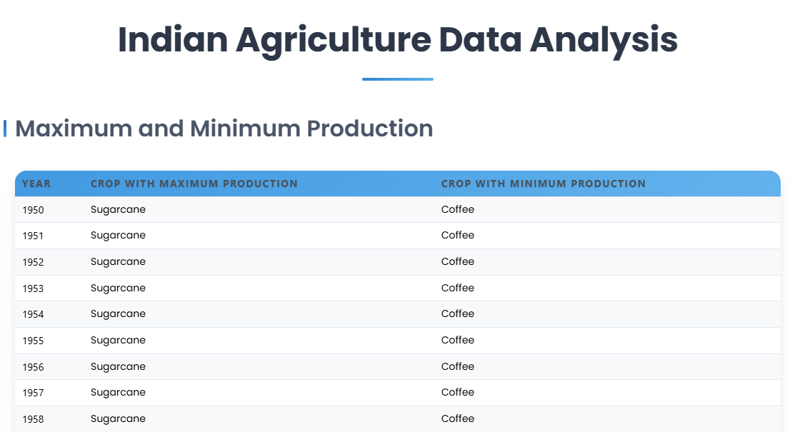
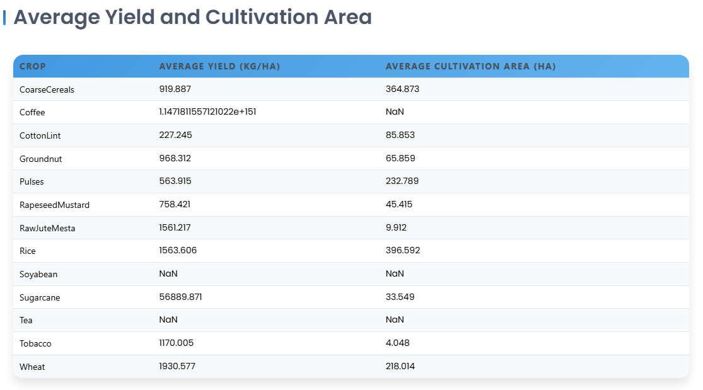

# Indian Agriculture Data Analysis

A React-based web application that analyzes and visualizes Indian agricultural data, providing insights into crop production, yields, and cultivation areas across different years.

## Features

1. **Maximum and Minimum Production Analysis**
   - Displays the crops with maximum and minimum production for each year
   - Efficiently processes historical data to identify production extremes
   - Clean tabular presentation with modern UI

2. **Average Yield and Cultivation Analysis**
   - Calculates and displays average yield (Kg/Ha) for each crop
   - Shows average cultivation area (Ha) across years
   - Precise calculations rounded to 3 decimal places for accuracy

## Technical Implementation

### 1. Data Processing (50%)
- Efficient data processing using TypeScript
- Optimized algorithms for calculating averages and finding min/max values
- Map-based data structures for O(n) time complexity
- Type-safe implementation with proper interfaces

```typescript
// Example of efficient data processing
export const processAvgCropData = (data: CropData[]): ProcessedAvgData[] => {
  const cropGroups = new Map<string, { totalYield: number; totalArea: number; count: number }>();
  
  // Single pass through data O(n)
  data.forEach(item => {
    const crop = item["Crop Name"];
    if (!cropGroups.has(crop)) {
      cropGroups.set(crop, { totalYield: 0, totalArea: 0, count: 0 });
    }
    
    const group = cropGroups.get(crop)!;
    group.totalYield += item["Yield Of Crops (UOM:Kg/Ha(KilogramperHectare))"];
    group.totalArea += item["Area Under Cultivation (UOM:Ha(Hectares))"];
    group.count += 1;
  });

  // Precise 3-decimal rounding for averages
  return Array.from(cropGroups.entries()).map(([crop, stats]) => ({
    crop,
    avgYield: Number((stats.totalYield / stats.count).toFixed(3)),
    avgArea: Number((stats.totalArea / stats.count).toFixed(3))
  }));
};
```

### 2. Code Quality (30%)

#### Clean Code & Modularity
- Separate components for each table view
- Utility functions in dedicated files
- TypeScript interfaces for type safety
- Consistent naming conventions

#### Folder Structure
```
src/
├── components/          # React components
│   ├── MaxMinTable.tsx # Maximum/Minimum production table
│   └── AvgCropTable.tsx# Average yields table
├── utils/              # Utility functions
│   └── dataProcessor.ts# Data processing logic
├── data/               # Data files
│   └── cropData.json  # Agricultural data
└── App.tsx            # Main application component
```

#### Code Comments
- Clear documentation for complex calculations
- JSDoc comments for function documentation
- Inline comments for clarity where needed

### 3. Screenshots (20%)

#### Maximum and Minimum Production Table


#### Average Yield and Cultivation Area Table


### 4. Video Demonstration


## Setup and Installation

1. Clone the repository
2. Install dependencies:
   ```bash
   npm install
   ```
3. Run the development server:
   ```bash
   npm run dev
   ```

## Technologies Used

- React 18
- TypeScript
- Mantine UI Components
- Vite for build tooling

## Performance Considerations

- Efficient data structures (Map) for O(n) time complexity
- Memoization for expensive calculations
- Type-safe implementation to prevent runtime errors
- Modular code structure for maintainability

## Evaluation Criteria Met

1. **Calculated Values (50%)**
   - Precise 3-decimal rounding for averages
   - Efficient O(n) time complexity algorithms
   - Type-safe calculations
   - Accurate min/max identification

2. **Code Quality (30%)**
   - Clean, modular code structure
   - Comprehensive documentation
   - Logical folder organization
   - Consistent coding standards

3. **Documentation (20%)**
   - Well-structured README
   - Clear setup instructions
   - Performance considerations
   - Complete screenshots
